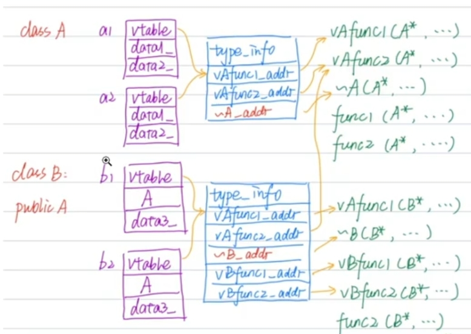

# C++多态与RTTI

## 1. 看示例代码，分析对象内存布局
```C++
class A 
{
public:
    A() {
        cout << "A::A()" << endl;
        _data1 = new int();
        _data2 = new int();
    }

    virtual void vAfunc1() { cout << "A::vAfunc1()" << endl; }

    virtual void vAfunc2() { cout << "A::vAfunc2()" << endl; }

    void func1() { cout << "A::func1()" << endl; }

    void func2() { cout << "A::func2()" << endl; }

    virtual ~A() {
        cout << "A::~A()" << endl;
        delete _data1;
        delete _data2;
    }

private:
    int *_data1 {nullptr};
    int *_data2 {nullptr};
};

class B : public A 
{
public:
    B() {
        cout << "B::B()" << endl;
        _data3 = new int();
    }

    virtual void vAfunc1() override { cout << "B::vAfunc1()" << endl; }

    virtual void vBfunc1() { cout << "B::vBfunc1()" << endl; }

    virtual void vBfunc2() { cout << "B::vBfunc2()" << endl; }

    void func2() { cout << "B::func2()" << endl; }

    virtual ~B() {
        cout << "B::~B()" << endl;
        delete _data3;
    }
private:
    int *_data3 {nullptr};
};
```

用class A实例化a1，a2，class B实例化b1，b2，内存模型如下：



使用示例：
```C++
int main() {
    A a;
    B b;
    a.vAfunc1();    // A::vAfunc1()
    a.func1();      // A::func1()
    
    b.vAfunc1();    // B::vAfunc1()
    // B里面没有func1，但B的指针可以隐式转成A的指针，所以调用A的func1
    b.func1();      // A::func1()
    b.func2();      // B::func2()

    cout  << "==================" << endl;
    A aa = b;
    // 虚表变了，变成A的虚表
    aa.vAfunc1();   // A::vAfunc1()
    aa.func1();     // A::func1()
    aa.func2();     // A::func2()

    cout  << "==================" << endl;

    A *aptr = &b;
    // 虽然aptr是A类型，但使用的还是b的虚表
    aptr->vAfunc1();    // B::vAfunc1()
    aptr->func1();      // A::func1()
    aptr->func2();      // A::func2()
    return 0;
}
```

## 2. 继承关系的父类如果需要析构函数，析构函数一般为虚
```C++
int main() {

    A *aptr =new B();
    delete aptr;

    cout << "======================" << endl;

    return 0;
}
```

输出：
```
A::A()
B::B()
B::~B()
A::~A()
======================
```
delete aptr时，会多态调用B的析构函数~B()，~B()析构函数执行完毕后会自动调用父类A的析构函数~A();<br>


假设A的析构非虚，那么输出如下：
```
A::A()
B::B()
A::~A()
======================
```
B的析构没有被调用，内存泄漏了。

## 3. 查看虚表中type_info
**应用点1**：有时候我们需要根据基类的指针判断其指向子类的类型

```C++
void test(A *a) {
    // 使用的虚表里面的type_info字段判断的
    if (typeid(*a) == typeid(A)) {
        cout << "a is A type: " << typeid(*a).name() << endl;
    }
    if (typeid(*a) == typeid(B)) {
        cout << "a is B type: " << typeid(*a).name() << endl;
    }
}

int main() {

    A *base = new B();
    test(base);

    return 0;
}
```
类似java中的instanceof

## 4. dynamic_case<type *>(e)
**应用点2**：将基类指针**安全的**转成派生类的指针，如果失败，返回nullptr
```C++
int main() {
    B b;
    A *a = &b;
    A *mm = dynamic_cast<A *>(&b);  // 成功
    B *nn = dynamic_cast<B *>(mm);  // 成功

    A a2;
    B *b2 = dynamic_cast<B *>(&a2); // 失败，b2是nullptr

    return 0;
}
```

